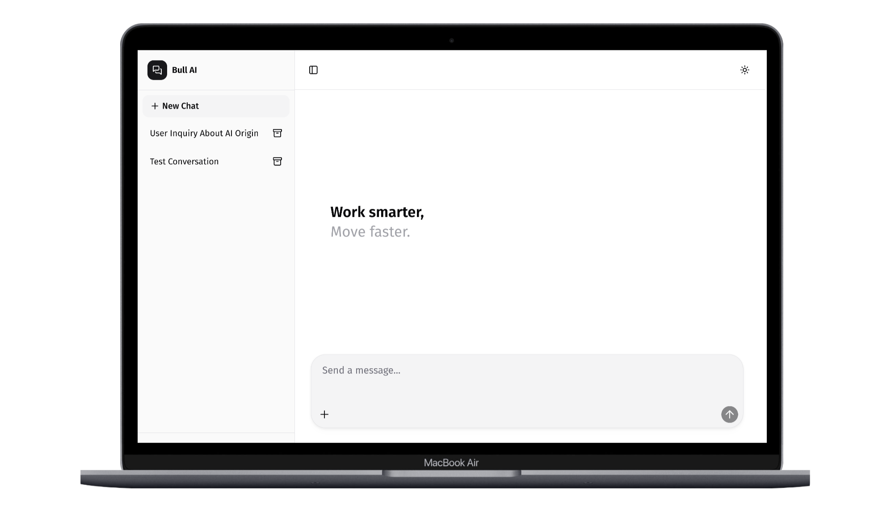
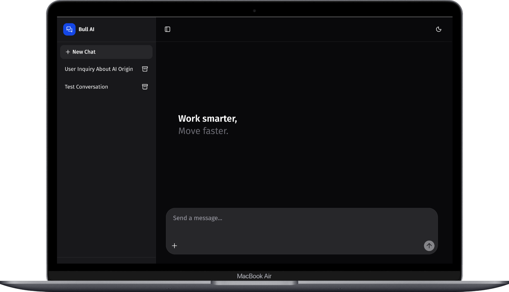

# Chat.Bull.Africa 🐂


[](https://opensource.org/licenses/MIT)
[](https://nextjs.org/)
[](https://workers.cloudflare.com/)
[](https://www.typescriptlang.org/)
[](https://github.com/dreemrworld/chat.bull.africa)

> A modern, privacy-first AI chatbot built with cutting-edge technologies. Deploy instantly on Cloudflare's global edge network. Free, open-source, and designed for the AI revolution in Africa.

## 🌟 Table of Contents

- [Features](#-features)
- [Demo](#-demo)
- [Quick Start](#-quick-start)
- [Installation](#-installation)
- [Tech Stack](#-tech-stack)
- [Usage](#-usage)
- [Contributing](#-contributing)
- [License](#-license)
- [Contact](#-contact)
- [About](#-about)
- [Resources](#-resources)
- [Screenshots](#-screenshots)
- [Why Star This Repo?](#-why-star-this-repo)

## 🚀 Features

- ✅ **Mobile Responsive**: Seamless experience across all devices
- ✅ **Free & Open Source**: MIT licensed, community-driven
- ✅ **Modern UI/UX**: Built with Assistant-UI and Shadcn/UI
- ✅ **Instant Deployment**: One-command deploy to Cloudflare Workers
- ✅ **Light/Dark Mode**: Automatic theme switching
- ✅ **Cloud Storage**: Assistant-UI cloud storage (200 MAU free, see env.example for setup)  
- ✅ **Multi-Provider Support**: Choose from OpenAI, Anthropic, Azure, AWS, GCP, Groq, Fireworks, Cohere, Ollama, Chrome AI
- ✅ **Web Search**: Integrated web search capabilities
- ✅ **Audio Responses**: Listen to AI responses with client-side text-to-speech (first time activation may take a few minutes)
- 🔄 **Coming Soon**: Image Generation, Auth, R2 Storage, MCP, RAG

## 🌐 Demo

Experience the live demo: **[chat.bull.africa](https://chat.bull.africa/)**

## ⚡ Quick Start

Get up and running in minutes:

```bash
# Clone the repository
git clone https://github.com/dreemrworld/chat.bull.africa.git
cd chat.bull.africa

# Install dependencies
pnpm install

# Set up environment (copy and configure)
cp env.example .env

# Run locally
pnpm run dev
```

Open [http://localhost:3000](http://localhost:3000) and start chatting!

## 📦 Installation

### Prerequisites

- Node.js 18+
- pnpm (recommended) or npm/yarn
- Cloudflare account (for deployment)

### Step-by-Step Setup

1. **Clone & Install**
   ```bash
   git clone https://github.com/dreemrworld/chat.bull.africa.git
   cd chat.bull.africa
   pnpm install
   ```

2. **Configure Environment**
   ```bash
   cp env.example .env
   # Edit .env with your API keys (Gemini recommended for free tier)
   ```

3. **Switch AI Providers** (Optional)
   - Follow [Assistant-UI instructions](https://www.assistant-ui.com/docs/getting-started#setup-backend-endpoint)
   - Supports: OpenAI, Anthropic, Azure, AWS, GCP, Groq, Fireworks, Cohere, Ollama, Chrome AI

4. **Deploy to Cloudflare**
   ```bash
   pnpm run deploy
   ```

That's it! Your AI chatbot is now live in 300+ locations worldwide.

## 🛠 Tech Stack

Built with modern, battle-tested technologies:

- **Frontend**: Next.js 15, React, TypeScript
- **UI/UX**: Assistant-UI, Shadcn/UI, Radix UI, Tailwind CSS
- **AI**: AI SDK 5, Google Gemini API
- **Deployment**: Cloudflare Workers, OpenNext (done for you)
- **Storage**: Assistant-UI cloud (200 MAU free) you may change ofcourse 

## 💻 Usage

### Local Development

```bash
pnpm run dev
```

### Production Deployment

```bash
pnpm run deploy
```

### Customization

- Modify `app/page.tsx` for UI changes
- Update `app/api/chat/route.ts` for AI logic
- Customize themes in `components/theme-provider.tsx`

## 🤝 Contributing

We welcome contributions! This project is built for the open-source community.

### How to Contribute

1. Fork the repository
2. Create a feature branch: `git checkout -b feature/amazing-feature`
3. Commit changes: `git commit -m 'Add amazing feature'`
4. Push to branch: `git push origin feature/amazing-feature`
5. Open a Pull Request

### Development Guidelines

- Follow existing code style
- Add tests for new features
- Update documentation
- Ensure mobile responsiveness

## 📄 License

This project is licensed under the MIT License - see the [LICENSE](LICENSE) file for details.

## 📞 Contact

- **Email**: [carlos@goat.africa](mailto:carlos@goat.africa)
- **Twitter**: [@dreemrworld](https://x.com/dreemrworld)
- **Website**: [dev.goat.africa](https://dev.goat.africa/)

## 👨‍💻 About

**Carlos Araújo** - Full-stack developer passionate about AI and African innovation.

> "I subscribe to Garry Kasparov's vision in *Deep Thinking: Where Machine Intelligence Ends and Human Creativity Begins*. I'm bullish on Artificial Intelligence in Africa because I'm bullish on African Intelligence."

My programming journey began just 10 months ago, accelerated by AI tools like DeepSeek, Qwen 3 Coder, Kimi, and Gemini. I want everyone to become a **VICTOR** of the AI revolution, not just a victim.

## 📚 Resources

1. [Assistant-UI Documentation](https://www.assistant-ui.com/docs/getting-started)
2. [Free LLM API Resources](https://github.com/dreemrworld/free-llm-api-resources)
3. [Deep Thinking | Garry Kasparov | Talks at Google](https://www.youtube.com/watch?v=zhkTHkIZJEc)
4. [Cloudflare Workers](https://www.cloudflare.com/)
5. [Live Demo](https://chat.bull.africa/)
6. [My First AI Project](https://chat.goat.africa/)
7. [Dev Profile](https://dev.goat.africa/)

## 📸 Screenshots

Mobile responsive and frictionless scrolling on any device. Screenshots for reference only - final output depends on browser zoom and device settings.

### Desktop (Light Mode)


### Desktop (Dark Mode)


### Mobile Devices
More screenshots available for Galaxy S21 Ultra, Xiaomi 12, Google Pixel 6 Pro in [`public/images/`](https://github.com/dreemrworld/chat.bull.africa/tree/main/public/images).

## ⭐ Why Star This Repo?

Don't star it just because it's free, open-source, and modern. **Star it so more people can discover, use, and benefit from privacy-first AI!**

- 🚀 **Save Time & Money**: Instant deployment, no complex setup
- 🔒 **Privacy-First**: Your data stays on your device
- 🌍 **Global Reach**: 300+ Cloudflare locations
- 🤝 **Community-Driven**: Help build the future of AI in Africa
- 🎯 **Easy to Customize**: Switch AI providers, add features
- 📈 **Learn & Grow**: Perfect for developers entering the AI space

**May the yield be with you!** 🌟

---

*Built with ❤️ for the open-source community. Clone, fork, contribute - let's build the AI future together!*

## 🙏 Acknowledgments

Special thanks to:
- [Assistant-UI](https://github.com/Yonom/assistant-ui) for the amazing starter template
- Google for generous Gemini API free tier
- Cloudflare for making global deployment accessible
- The open-source community for inspiration and support

---

*README crafted with [StackEdit](https://stackedit.io/) and screenshots from [Mobile Responsive Simulator](https://chromewebstore.google.com/detail/mobile-simulator-responsi/ckejmhbmlajgoklhgbapkiccekfoccmk)*
